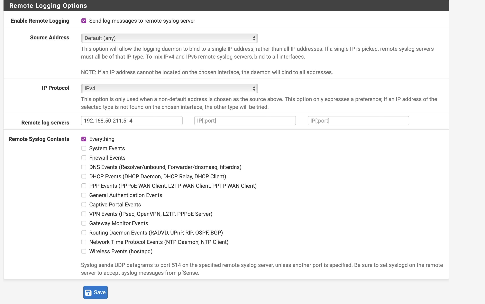
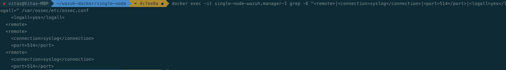
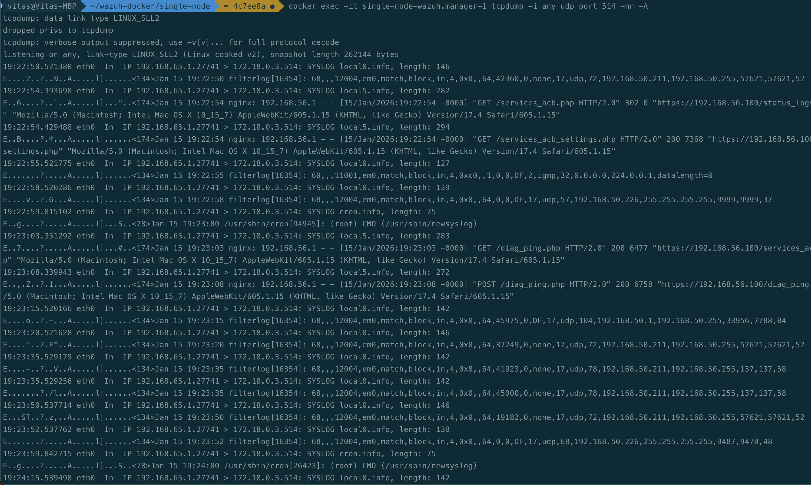

# FJU-Threat-Hunting2025: 期末實作專案

## 🛡️ Wazuh AI Threat Hunting & pfSense Integration Project

### **1. MCP Server for Wazuh - Threat Hunting 展示**
本部分展示如何透過 **Claude Desktop** 整合 **MCP Server**，實現以自然語言進行資安管理。

#### 核心實作紀錄

* **環境架構配置**：開發並完成 claude_desktop_config.json 的環境變數定義，將 Wazuh MCP Server 成功封裝至 Claude 運行環境。

* **安全認證整合**：建立基於 API Token 的認證機制，確保 LLM 與 Wazuh Manager 之間的通訊符合最小權限原則（Principle of Least Privilege）。

* **資安工具鏈對接**：完成工具集（Toolbox）的動態載入，賦予 AI 助理直接檢索端點狀態與安全日誌之能力。

#### 實作驗證截圖
步驟說明,實作截圖證明
Step 1: MCP 環境配置驗證展示 claude_desktop_config.json 的參數配置。,""
Step 2: AI 工具對接成功Claude 成功掛載 Wazuh 專屬資安工具集。,""

---

### 2. pfSense 與 Wazuh 整合實作

本部分展示如何將 pfSense (BSD-based Firewall) 產生的系統與防火牆日誌，透過網路層級的對接，即時推送至 Wazuh Manager 進行監控與分析。

#### 核心實作紀錄

* **跨網段對接**：克服虛擬環境與實體網路 IP 衝突（192.168.1.1），重新配置 pfSense LAN (192.168.56.100) 與 WAN 介面，確保與 Wazuh Manager (192.168.18.133) 之連通性。

* **Wazuh 接收器配置**：手動修改 Wazuh Manager 容器內之 ossec.conf，新增 UDP 514 (Syslog) 監聽服務，並開啟 <logall>yes</logall> 存檔開關以捕捉所有原始數據。

* **數據即時監控**：部署 tcpdump 診斷工具，確認 pfSense 產生的 filterlog 與 nginx 登入事件已成功傳入 Wazuh。

#### 整合步驟

1.**pfSense 端**：於 Status > System Logs > Settings 開啟 Remote Logging，格式設定為 RFC 5424，並精確指向 Wazuh Manager 提供之 514 埠位。

2.**Wazuh 端**：配置 ossec.conf 以接收 UDP 514 埠的 Syslog 流量，並重新啟動 Manager 服務。

3.**數據驗證**：透過 tail -f /var/ossec/logs/archives/archives.log 觀察即時噴發的日誌流，確保防火牆阻擋 (Drop) 與系統異動事件已被 Wazuh 完整擷取。

#### 實作驗證截圖

| 步驟說明 | 實作截圖證明 |
| :--- | :--- |
| **Step 1: pfSense 遠端日誌發送設定** |  |
| **Step 2: Wazuh Manager 設定檔驗證** |  |
| **Step 3: tcpdump 即時封包攔截驗證** |  |

**技術筆記**：在實作過程中，透過 tcpdump -i any udp port 514 -A 成功攔截到來自 pfSense 的封包，證實數據已跨越虛擬網路邊界抵達 Manager 容器。相關 XML 配置細節請參閱本倉庫之 ossec_manager_syslog.xml。

---

### 3. 進階威脅分析與 AI 輔助偵測 (Advanced Threat Analysis)

本章節探討如何利用 ET-BERT 模型 與 大語言模型 (LLM) 針對 pfSense 收集到的加密流量與惡意活動進行深度分析。

#### 加密流量分析：ET-BERT 與 遠端工具偵測

針對 TeamViewer、AnyDesk 等遠端控制軟體產生的加密流量，傳統過濾器難以識別其惡意意圖。

* **ET-BERT 應用**：透過 Pre-train (於海量無標籤流量學習) 與 Fine-tuned (針對特定軟體流量微調) 兩階段，實現對加密流量的精準分類。

* **實作意義**：本專案透過 pfSense 擷取通訊流量並對接至 Wazuh 平台，驗證了在加密環境下依然具備威脅可視性（Visibility）。

#### 惡意行為識別：Ransomware、PCAP 與 Cobalt Strike

* **Cobalt Strike 偵測**：針對其 Beaconing 行為 (心跳連線)，利用 LLM 分析特定的 HTTP Header 特徵與流量規律。

* **勒索軟體分析**：利用 PCAP 流量包進行特徵提取，針對勒索軟體在執行加密前的 橫向移動 (Lateral Movement) 行為進行預警。

#### LLM 效能對比與輔助分析 (LLM Compare)

本實驗對比了 GPT-4、Claude 3 與 Gemini 在資安領域的處理表現：

* **日誌解析**：LLM 展現強大語義理解能力，能將 pfSense filterlog 的原始標籤轉化為直觀的攻擊意圖描述。

* **偵測建議**：AI 可根據流量特徵自動生成 Wazuh 偵測規則 (Ruleset)，大幅縮短從威脅發現到防禦部署的反應時間。

**實作驗證結論**：透過 pfSense 成功將數據導出至 Wazuh，結合 AI 分析技術，可大幅提升對 Encrypted Traffic 的分析深度，達成從「流量攔截」到「智能研判」的資安防禦閉環。
